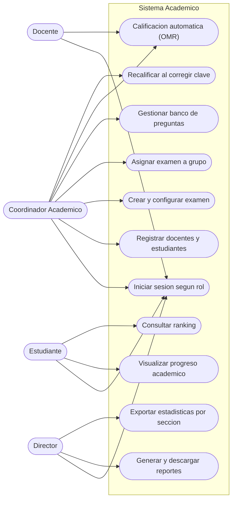
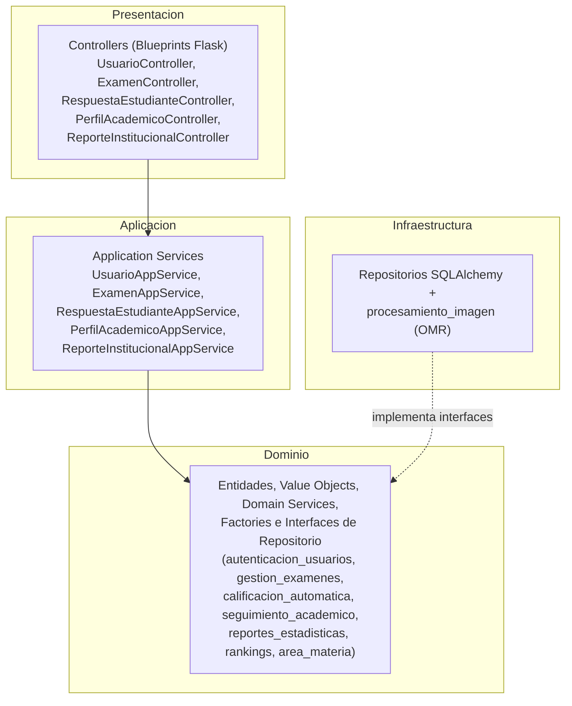

# Sistema Academico

Sistema academico organizado siguiendo una arquitectura guiada por el dominio
(Domain-Driven Design) en capas, implementado en Python con Flask y SQLAlchemy.

Este README reune la informacion que pide el entregable de la **Practica 9 —
Convenciones de Codificacion**: proposito, funcionalidades de alto nivel
(casos de uso y prototipo), modelo de dominio, vista general de arquitectura,
convenciones de codificacion y el tablero de gestion en Trello.

## Proposito

Representar un sistema academico que permita gestionar usuarios, examenes,
respuestas de estudiantes, calificaciones automaticas (OMR por vision por
computadora), seguimiento academico, rankings y reportes institucionales,
separando responsabilidades para que el codigo sea ordenado, legible y
mantenible.

## Funcionalidades de Alto Nivel

El sistema cubre estas funcionalidades:

- Registro e inicio de sesion de usuarios segun rol.
- Gestion de roles: estudiante, docente, coordinador y director.
- Creacion, configuracion y asignacion de examenes desde un banco de preguntas.
- Envio y calificacion automatica de respuestas (procesamiento OMR).
- Consulta de resultados y progreso academico.
- Generacion de reportes institucionales y estadisticas grupales.
- Consulta de rankings academicos.

### Diagrama de Casos de Uso (UML)

Actores del sistema (segun `RolEnum`) y sus casos de uso principales:



### Prototipo / GUI

La interfaz web (Flask + Jinja2) esta en
`sistema_academico_ddd/app/presentacion/templates/`. Pantallas disponibles:

| Pantalla | Plantilla | Descripcion |
|---|---|---|
| Inicio | `index.html` | Portada con accesos a examenes, calificacion y reportes. |
| Usuarios | `usuarios/listar.html`, `usuarios/editar.html` | Alta, edicion y listado de usuarios con rol. |
| Examenes | `examenes/listar.html`, `examenes/editar.html` | Crear, configurar y listar examenes. |
| Calificacion (OMR) | `respuestas/listar.html` | Procesar hojas de respuesta escaneadas. |
| Seguimiento | `perfil_academico/listar.html` | Progreso y evolucion de notas del estudiante. |
| Reportes | `reportes/listar.html` | Estadisticas institucionales por examen y grupo. |

> **Evidencia pendiente:** adjuntar capturas de pantalla de estas vistas en
> `docs/uml/` o `docs/gui/` antes de la entrega final.

## Modelo de Dominio: Diagrama de Clases + Modulos

El dominio se organiza en modulos (subdominios), cada uno con su propio espacio:

- **autenticacion_usuarios:** usuarios, credenciales y roles.
- **gestion_examenes:** examenes, preguntas, configuracion y asignaciones.
- **calificacion_automatica:** respuestas, calificaciones y servicio de calificacion.
- **seguimiento_academico:** progreso, evolucion de notas y desglose por area.
- **reportes_estadisticas:** reportes institucionales y estadisticas grupales.
- **rankings:** posiciones y mejores puntajes de estudiantes.
- **area_materia:** areas y materias academicas.

Diagrama de clases completo (entidades, agregados, value objects, servicios de
dominio, factories e interfaces de repositorio), generado desde el modelo UML:


Los modelos UML originales (StarUML) estan en
[`docs/uml/ISUML.mdj`](docs/uml/ISUML.mdj) (clases y casos de uso) y
[`docs/uml/arquitectura_sistema_academico.mdj`](docs/uml/arquitectura_sistema_academico.mdj)
(vista de arquitectura).

## Vista General de Arquitectura: Diagrama de Paquetes + Clases

Arquitectura DDD en cuatro capas. Las dependencias apuntan siempre hacia el
dominio (regla de dependencia de Clean Architecture):



Estructura de carpetas:

```text
SISTEMA_ACADEMICO_V2/
├── docs/
│   ├── uml/                     # Diagrama de clases (PNG) y modelo StarUML (.mdj)
│   └── trello/                  # Documentacion del tablero Kanban/Scrum
└── sistema_academico_ddd/       # Implementacion (Python/Flask), ver su propio README
    ├── app/
    │   ├── presentacion/        # Controllers (Blueprints) + templates + static
    │   ├── aplicacion/          # Application Services (casos de uso)
    │   ├── dominio/             # Entidades, VOs, Domain Services, Interfaces repo
    │   └── infraestructura/     # Repositorios SQLAlchemy + procesamiento OMR
    ├── migrations/
    └── tests/
```

## Convenciones de Codificacion: Practica + Fragmento de Codigo

El proyecto sigue [PEP 8](https://peps.python.org/pep-0008/), reforzado con la
extension **SonarLint** en el IDE para detectar bugs, code smells y
vulnerabilidades. El detalle completo, con fragmentos de codigo antes/despues
(except desnudo, numeros magicos, naming consistente), esta en el README de la
implementacion:

**[`sistema_academico_ddd/README.md`](sistema_academico_ddd/README.md#convenciones-de-codificación-práctica--fragmento-de-código)**

Resumen de convenciones aplicadas:

- `snake_case` para modulos, funciones, variables y parametros.
- `PascalCase` para clases y enumeraciones; `UPPER_SNAKE_CASE` para constantes.
- Identificadores en espanol, ASCII (sin tildes ni `ñ`), descriptivos y sin
  ocultar funciones incorporadas como `id`.
- Imports agrupados: biblioteca estandar, terceros y aplicacion.
- Manejo de errores explicito; nunca `except:` desnudo.
- Sin numeros magicos ni rutas hardcodeadas; `logging` en vez de `print`.
- Una responsabilidad principal por modulo dentro de la arquitectura DDD.

## Tablero de Gestion (Kanban / Scrum en Trello)

El seguimiento del proyecto se lleva en un tablero de Trello basado en la
plantilla **User Story Mapping** (historias por rol + flujo Product Backlog /
Sprint Backlog / Kanban).

**Tablero:** https://trello.com/invite/b/6a01f35ff286ed0f23f5fc1a/ATTIb6448387dde7723fca198a76b17a29ff6EEE3DEB/sistema-academico

Detalle documentado en **[`docs/trello/TABLERO_KANBAN.md`](docs/trello/TABLERO_KANBAN.md)**.

## Puesta en marcha y pruebas

La implementacion, instrucciones de ejecucion y pruebas estan en
[`sistema_academico_ddd/`](sistema_academico_ddd/README.md):

```bash
cd sistema_academico_ddd
python -m venv venv
venv\Scripts\activate          # Windows (cmd/powershell)
pip install -r requirements.txt
flask db upgrade
python run.py                  # http://127.0.0.1:5000
pytest                         # ejecutar pruebas
```

## Stack tecnologico

| Capa | Tecnologia |
|---|---|
| Lenguaje | Python 3.11+ |
| Framework Web MVC | Flask 3 |
| ORM | SQLAlchemy (Flask-SQLAlchemy) |
| Migraciones | Flask-Migrate (Alembic) |
| Vision por computadora (OMR) | OpenCV, NumPy, scikit-image |
| Base de datos (dev) | SQLite |
