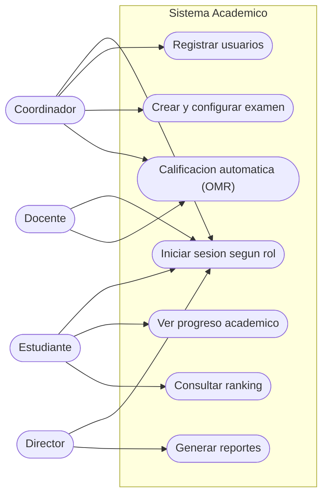
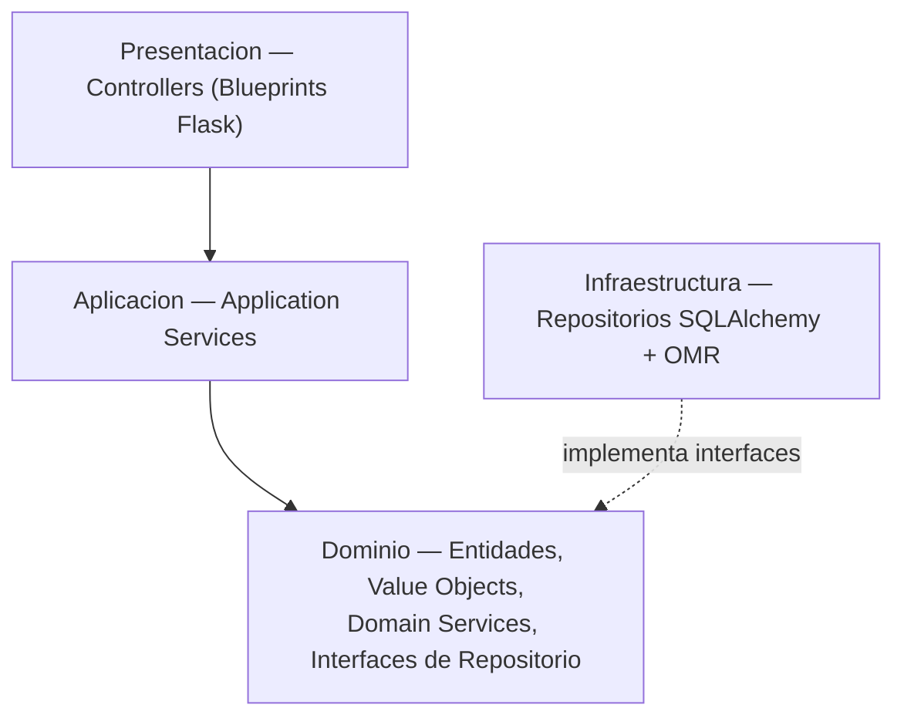

# Sistema Academico

Sistema academico con arquitectura guiada por el dominio (DDD) en capas,
implementado en Python con Flask y SQLAlchemy.

## Proposito

Gestionar usuarios, examenes, respuestas de estudiantes, calificacion
automatica (OMR por vision por computadora), seguimiento academico, rankings
y reportes institucionales, separando responsabilidades para que el codigo
sea ordenado, legible y mantenible.

## Funcionalidades de Alto Nivel

- Registro e inicio de sesion segun rol (estudiante, docente, coordinador, director).
- Creacion, configuracion y asignacion de examenes desde un banco de preguntas.
- Envio y calificacion automatica de respuestas (procesamiento OMR).
- Consulta de progreso academico y rankings.
- Generacion de reportes institucionales y estadisticas grupales.

### Diagrama de Casos de Uso (UML)



### Prototipo / GUI

Interfaz web (Flask + Jinja2) en `sistema_academico_ddd/app/presentacion/templates/`:

| Pantalla | Funcion |
|---|---|
| Inicio (`index.html`) | Accesos a examenes, calificacion y reportes. |
| Usuarios | Alta, edicion y listado de usuarios con rol. |
| Examenes | Crear, configurar y listar examenes. |
| Calificacion (OMR) | Procesar hojas de respuesta escaneadas. |
| Seguimiento | Progreso y evolucion de notas del estudiante. |
| Reportes | Estadisticas institucionales por examen y grupo. |

## Modelo de Dominio: Clases + Modulos

El dominio se divide en subdominios, cada uno con su propio espacio:

| Modulo | Responsabilidad |
|---|---|
| `autenticacion_usuarios` | Usuarios, credenciales y roles. |
| `gestion_examenes` | Examenes, preguntas, configuracion y asignaciones. |
| `calificacion_automatica` | Respuestas, calificaciones y servicio de calificacion. |
| `seguimiento_academico` | Progreso, evolucion de notas y desglose por area. |
| `reportes_estadisticas` | Reportes institucionales y estadisticas grupales. |
| `rankings` | Posiciones y mejores puntajes de estudiantes. |
| `area_materia` | Areas y materias academicas. |

Diagrama de clases completo (entidades, agregados, value objects, servicios de
dominio e interfaces de repositorio):


Modelos UML fuente (StarUML): [`ISUML.mdj`](docs/uml/ISUML.mdj) y
[`arquitectura_sistema_academico.mdj`](docs/uml/arquitectura_sistema_academico.mdj).

## Arquitectura: Paquetes + Clases

Arquitectura DDD en cuatro capas; las dependencias apuntan siempre hacia el dominio:



```text
SISTEMA_ACADEMICO_V2/
├── docs/
│   ├── uml/                     # Diagramas de clases y modelos StarUML (.mdj)
│   └── trello/                  # Tablero Kanban/Scrum documentado
└── sistema_academico_ddd/       # Implementacion (Python/Flask)
    ├── app/
    │   ├── presentacion/        # Controllers + templates
    │   ├── aplicacion/          # Application Services
    │   ├── dominio/             # Entidades, VOs, Domain Services, Interfaces repo
    │   └── infraestructura/     # Repositorios SQLAlchemy + procesamiento OMR
    ├── migrations/
    └── tests/
```

## Convenciones de Codificacion

El proyecto sigue [PEP 8](https://peps.python.org/pep-0008/), reforzado con
**SonarLint** en el IDE para detectar bugs, code smells y vulnerabilidades.

- `snake_case` para modulos, funciones y variables; `PascalCase` para clases;
  `UPPER_SNAKE_CASE` para constantes.
- Identificadores en espanol, ASCII y descriptivos (sin ocultar `id`).
- Manejo de errores explicito; nunca `except:` desnudo.
- Sin numeros magicos ni rutas hardcodeadas; `logging` en vez de `print`.

Detalle con fragmentos antes/despues en
**[`sistema_academico_ddd/README.md`](sistema_academico_ddd/README.md#convenciones-de-codificación-práctica--fragmento-de-código)**.

## Tablero de Gestion (Trello)

Tablero Kanban/Scrum con la plantilla **User Story Mapping**:
[abrir tablero](https://trello.com/invite/b/6a01f35ff286ed0f23f5fc1a/ATTIb6448387dde7723fca198a76b17a29ff6EEE3DEB/sistema-academico)
· detalle en [`docs/trello/TABLERO_KANBAN.md`](docs/trello/TABLERO_KANBAN.md).

## Puesta en marcha

```bash
cd sistema_academico_ddd
python -m venv venv
venv\Scripts\activate
pip install -r requirements.txt
flask db upgrade
python run.py        # http://127.0.0.1:5000
pytest               # pruebas
```

## Stack tecnologico

Python 3.11+ · Flask 3 · SQLAlchemy (Flask-SQLAlchemy) · Flask-Migrate (Alembic)
· OpenCV / NumPy / scikit-image (OMR) · SQLite (dev).
