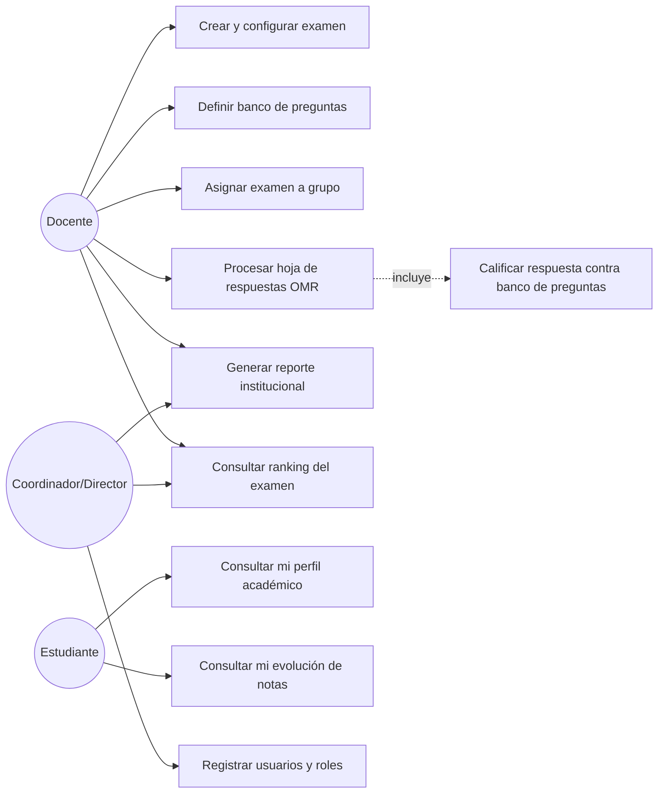
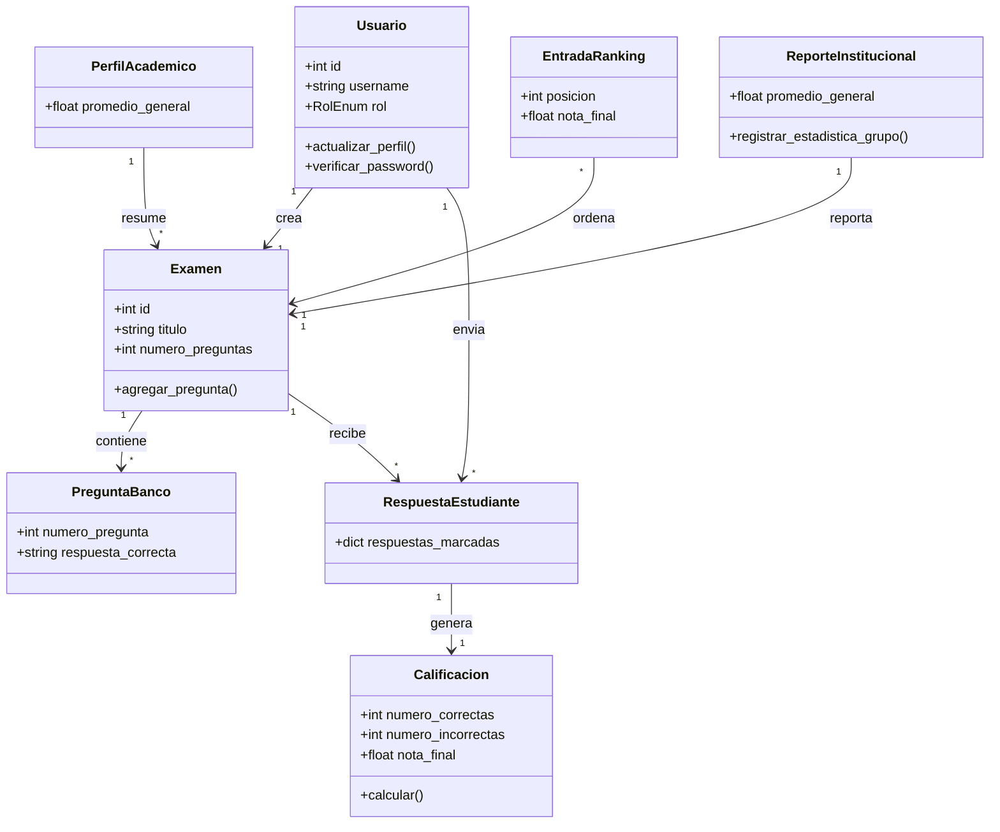
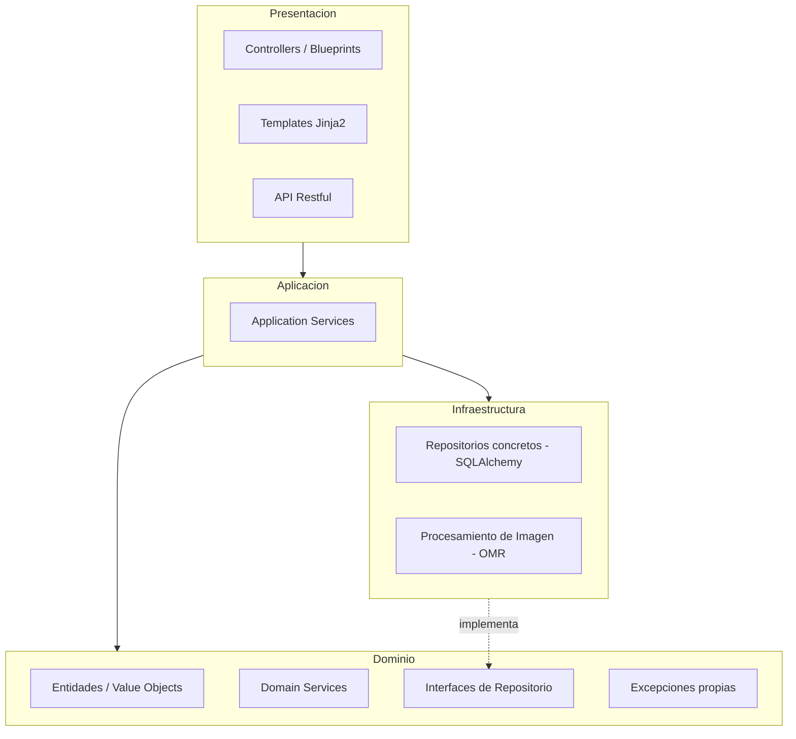

# Sistema Académico

Sistema web para gestionar exámenes, calificarlos automáticamente a partir de hojas de respuesta escaneadas (OMR / visión por computadora), hacer seguimiento académico de los estudiantes y generar reportes institucionales. El proyecto está organizado siguiendo una arquitectura guiada por dominio (**DDD**).

Desarrollado para el curso de Ingeniería de Software II (UNSA-EPCC) — Laboratorios 6 a 10.

## Propósito

Con este proyecto busco representar un sistema académico que permita gestionar usuarios, exámenes, respuestas de estudiantes, calificaciones automáticas, seguimiento académico, rankings y reportes institucionales.

La idea principal es separar bien las responsabilidades del sistema para que el código sea más ordenado, fácil de entender y sencillo de mantener.

## Funcionalidades

### Funcionalidades de alto nivel

- Registro e inicio de sesión de usuarios.
- Gestión de roles: estudiante, docente, coordinador y director.
- Creación, configuración y asignación de exámenes.
- Envío de respuestas por parte de los estudiantes.
- Calificación automática de respuestas (OMR).
- Consulta de resultados y progreso académico.
- Generación de reportes institucionales.
- Consulta de rankings académicos.

### Diagrama de casos de uso



### Prototipo (interfaz actual)

La interfaz web (Flask + Jinja2) tiene una versión funcional con: página de inicio, listado/creación/edición de usuarios, listado/creación/edición de exámenes, carga de hojas escaneadas para calificación, y visualización de reportes. Además, el módulo de Usuarios expone una **API RESTful** (`/api/usuarios`) para integraciones externas.

Capturas / flujo de pantallas: `docs/prototipo/` *(agregar screenshots aquí)*.

## Modelo de dominio

He organizado el dominio en módulos para que cada parte del negocio tenga su propio espacio:

- **autenticacion_usuarios:** usuarios, credenciales y roles.
- **gestion_examenes:** exámenes, preguntas, configuración y asignaciones.
- **calificacion_automatica:** respuestas, calificaciones y servicio de calificación.
- **seguimiento_academico:** progreso, evolución de notas y desglose por área.
- **reportes_estadisticas:** reportes institucionales y estadísticas grupales.
- **rankings:** posiciones y mejores puntajes de estudiantes.
- **area_materia:** áreas y materias académicas.

### Diagrama de clases (simplificado)



## Vista general de arquitectura

Arquitectura en capas (**Domain-Driven Design**):



### Diagrama de paquetes (estructura real del código)

```
app/
├── presentacion/       # Controllers (Blueprints) + templates + static + API JSON
├── aplicacion/          # Application Services (casos de uso)
├── dominio/             # Entidades, Value Objects, Domain Services,
│                        # Interfaces de Repositorio, Excepciones propias (por subdominio)
│   ├── autenticacion_usuarios/
│   ├── area_materia/
│   ├── gestion_examenes/
│   ├── calificacion_automatica/
│   ├── rankings/
│   ├── seguimiento_academico/
│   └── reportes_estadisticas/
└── infraestructura/
    ├── repositorios/            # Implementaciones concretas (SQLAlchemy)
    └── procesamiento_imagen/    # Servicio OMR (migrado del proyecto de escritorio)
```

## Convenciones de codificación

Se sigue **PEP 8** (guía oficial de estilo de Python) en todo el proyecto:

| Elemento | Convención | Ejemplo en el código |
|---|---|---|
| Módulos/archivos | `snake_case` | `respuesta_estudiante_app_service.py` |
| Clases | `PascalCase` | `class RespuestaEstudiante(db.Model):` |
| Funciones/métodos/variables | `snake_case` | `def promedio_nota_por_examen(examen_id):` |
| Privado (convención) | prefijo `_` | `self._repositorio`, `self._ETAPAS` |
| Excepciones propias | sufijo `Error` | `UsernameEnUsoError`, `ExamenNoEncontradoError` |
| Docstrings | triple comilla, primera línea imperativa | ver ejemplo abajo |

Ejemplo real (`app/dominio/gestion_examenes/examen.py`):

```python
class Examen(db.Model):
    __tablename__ = "examenes"

    id = db.Column(db.Integer, primary_key=True)
    titulo = db.Column(db.String(150), nullable=False)

    def agregar_pregunta(self, pregunta: PreguntaBanco) -> None:
        if any(p.numero_pregunta == pregunta.numero_pregunta for p in self.preguntas):
            raise PreguntaDuplicadaError(pregunta.numero_pregunta)
        pregunta.examen = self
        self.preguntas.append(pregunta)
```

Además, cada capa (`presentacion`, `aplicacion`, `dominio`, `infraestructura`) solo importa de las capas permitidas por DDD: `presentacion` nunca accede a SQLAlchemy directo, `dominio` nunca importa Flask.

## Puesta en marcha

```bash
python -m venv venv
source venv/bin/activate      # Windows: venv\Scripts\activate
pip install -r requirements.txt

export FLASK_APP=run.py        # Windows (cmd): set FLASK_APP=run.py
flask db upgrade               # crea/actualiza el esquema via Alembic
python run.py                  # http://127.0.0.1:5000
```

Si modificas una entidad de dominio (nueva columna, nueva clase, etc.), genera una nueva migracion en vez de borrar la base de datos:

```bash
flask db migrate -m "Descripcion del cambio"
flask db upgrade
```

## Pruebas

```bash
pytest
```

48 pruebas cubren: los casos de uso de cada módulo, las reglas de negocio del dominio, el CRUD completo por HTTP, y el nuevo endpoint RESTful de usuarios.

## Stack tecnológico

| Capa                             | Tecnología                        |
|----------------------------------|-----------------------------------|
| Lenguaje                         | Python 3.11+                      |
| Framework Web MVC                | Flask 3                           |
| Framework ORM                    | SQLAlchemy (Flask-SQLAlchemy)     |
| Migraciones                      | Flask-Migrate (Alembic)           |
| Visión por computadora (OMR)     | OpenCV, NumPy, scikit-image       |
| Base de datos (dev)              | SQLite                            |
| Testing                          | pytest                            |
| Análisis estático                | SonarLint / pyflakes              |

## Estilos de Codificación

Trabajo individual (Lab 10): se aplicaron al menos 4 estilos de
programación distintos por cada modulo/subdominio del sistema. La
lista completa de estilos disponibles era: *Cookbook, Pipeline,
Things, Error/Exception Handling, Persistent-Tables, Lazy-Rivers,
Trinity y Restful*. Antes de cada entrega se corrió `pytest` (48
pruebas, todas en verde) y se limpiaron con `pyflakes` los imports
muertos y otros code smells introducidos.

### 1. `autenticacion_usuarios` + `area_materia`

**Error/Exception Handling** — excepciones de dominio propias en vez de
`ValueError` genéricos ([excepciones.py](app/dominio/autenticacion_usuarios/excepciones.py)):

```python
class UsernameEnUsoError(UsuarioError):
    def __init__(self, username: str):
        super().__init__(f"El username '{username}' ya esta en uso")
        self.username = username
```

**Things** — el `Usuario` protege su propio invariante y muta su propio
estado, en vez de que la capa de aplicación le asigne atributos desde
afuera ([usuario.py](app/dominio/autenticacion_usuarios/usuario.py)):

```python
def actualizar_perfil(self, username: str, rol: RolEnum) -> None:
    self.username = username
    self.rol = rol
```

**Persistent-Tables** — conteo agregado por rol con `GROUP BY`, en vez
de un `Counter` en Python ([usuario_repositorio_impl.py](app/infraestructura/repositorios/usuario_repositorio_impl.py)):

```python
def contar_por_rol(self) -> Dict[RolEnum, int]:
    filas = db.session.query(Usuario.rol, func.count(Usuario.id)).group_by(Usuario.rol).all()
    return {rol: cantidad for rol, cantidad in filas}
```

**Lazy-Rivers** — generador que trae usuarios en lotes (`yield_per`)
en vez de materializar toda la tabla:

```python
def iterar_todos(self) -> Iterator[Usuario]:
    for usuario in db.session.query(Usuario).yield_per(50):
        yield usuario
```

### 2. `gestion_examenes`

**Cookbook** — `crear_examen` se lee como una receta de pasos con
nombre propio ([examen_app_service.py](app/aplicacion/examen_app_service.py)):

```python
def crear_examen(self, titulo, materia_id, creado_por_id, numero_preguntas, ...):
    self._validar_numero_preguntas(numero_preguntas)
    examen = self._construir_examen_con_configuracion(...)
    return self._persistir_examen_nuevo(examen)
```

**Error/Exception Handling** — `NumeroPreguntasInvalidoError`,
`ExamenNoEncontradoError`, `PreguntaDuplicadaError` en
[excepciones.py](app/dominio/gestion_examenes/excepciones.py).

**Things** — el `Examen` protege el invariante "no dos preguntas con
el mismo número" ([examen.py](app/dominio/gestion_examenes/examen.py)):

```python
def agregar_pregunta(self, pregunta: PreguntaBanco) -> None:
    if any(p.numero_pregunta == pregunta.numero_pregunta for p in self.preguntas):
        raise PreguntaDuplicadaError(pregunta.numero_pregunta)
    pregunta.examen = self
    self.preguntas.append(pregunta)
```

**Persistent-Tables** — conteo de preguntas vía `COUNT` SQL en vez de
`len(examen.preguntas)` ([examen_repositorio_impl.py](app/infraestructura/repositorios/examen_repositorio_impl.py)).

### 3. `calificacion_automatica`

**Pipeline** — `procesar_hoja_escaneada` es una tubería de etapas
(`_ETAPAS`) donde cada una recibe el `contexto` de la anterior
([respuesta_estudiante_app_service.py](app/aplicacion/respuesta_estudiante_app_service.py)):

```python
self._ETAPAS = [
    self._etapa_obtener_examen,
    self._etapa_escanear_y_corregir,
    self._etapa_extraer_respuestas_marcadas,
    self._etapa_guardar_respuesta,
    self._etapa_calificar_y_guardar,
]
...
for etapa in self._ETAPAS:
    contexto = etapa(contexto)
return contexto["respuesta"]
```

**Things** — `Calificacion` sabe derivar su propia nota
([calificacion.py](app/dominio/calificacion_automatica/calificacion.py)):

```python
@classmethod
def calcular(cls, respuesta_id, numero_correctas, numero_incorrectas,
             numero_en_blanco, puntaje_por_pregunta, penalizacion_por_error) -> "Calificacion":
    puntaje = numero_correctas * puntaje_por_pregunta
    puntaje -= numero_incorrectas * penalizacion_por_error
    return cls(..., nota_final=max(puntaje, 0.0))
```

**Error/Exception Handling** — reutiliza `ExamenNoEncontradoError` (el
mismo error significa lo mismo en todo el sistema).

**Persistent-Tables** — promedio y conteo agregados con SQL en vez de
Python ([respuesta_estudiante_repositorio_impl.py](app/infraestructura/repositorios/respuesta_estudiante_repositorio_impl.py)):

```python
def promedio_nota_por_examen(self, examen_id: int) -> float:
    promedio = (
        db.session.query(func.avg(Calificacion.nota_final))
        .join(RespuestaEstudiante, Calificacion.respuesta_id == RespuestaEstudiante.id)
        .filter(RespuestaEstudiante.examen_id == examen_id)
        .scalar()
    )
    return float(promedio) if promedio is not None else 0.0
```

### 4. `rankings` + `reportes_estadisticas`

**Persistent-Tables** — `top_n_por_examen` usa `ORDER BY` + `LIMIT` en
vez de `sorted(...)[:n]` en Python; `contar_por_umbral_nota` usa dos
`COUNT` filtrados en vez de `sum(1 for ...)`
([ranking_repositorio_impl.py](app/infraestructura/repositorios/ranking_repositorio_impl.py)).

**Lazy-Rivers** — `iterar_por_examen` recorre el ranking completo de
forma perezosa:

```python
def iterar_por_examen(self, examen_id: int) -> Iterator[EntradaRanking]:
    consulta = (
        db.session.query(EntradaRanking)
        .filter_by(examen_id=examen_id)
        .order_by(EntradaRanking.posicion.asc())
        .yield_per(50)
    )
    for entrada in consulta:
        yield entrada
```

**Things** — `ReporteInstitucional` crea y enlaza sus propias
`EstadisticaGrupal` ([reporte_institucional.py](app/dominio/reportes_estadisticas/reporte_institucional.py)):

```python
def registrar_estadistica_grupo(self, asignacion_grupo_id, promedio_grupo,
                                 numero_aprobados, numero_desaprobados) -> EstadisticaGrupal:
    estadistica = EstadisticaGrupal(...)
    estadistica.reporte = self
    self.estadisticas_grupales.append(estadistica)
    return estadistica
```

**Error/Exception Handling** — `generar_reporte` valida que el examen
exista reutilizando `ExamenNoEncontradoError`
([reporte_institucional_app_service.py](app/aplicacion/reporte_institucional_app_service.py)).

**Cookbook** — `generar_reporte` se lee como una receta: cada paso esta
extraido en su propio metodo con nombre propio, y el cuerpo describe
*que* se hace, no *como*:

```python
def generar_reporte(self, examen_id: int) -> ReporteInstitucional:
    self._validar_examen_existe(examen_id)
    reporte = self._construir_reporte_con_estadisticas(examen_id)
    self._registrar_estadisticas_por_grupo(reporte, examen_id)
    return self._persistir_reporte(reporte)
```

**Persistent-Tables** — el promedio y la desviacion estandar del reporte
se calculan con agregaciones `AVG` en SQL en vez de traer todas las notas
a memoria y recorrerlas con `statistics`; la desviacion poblacional se
deriva de dos promedios pedidos en la misma consulta
([reporte_institucional_repositorio_impl.py](app/infraestructura/repositorios/reporte_institucional_repositorio_impl.py)):

```python
promedio_nota, promedio_cuadrados = (
    db.session.query(
        func.avg(Calificacion.nota_final),
        func.avg(Calificacion.nota_final * Calificacion.nota_final),
    )
    .join(RespuestaEstudiante, Calificacion.respuesta_id == RespuestaEstudiante.id)
    .filter(RespuestaEstudiante.examen_id == examen_id)
    .one()
)
varianza = float(promedio_cuadrados) - promedio * promedio
return promedio, math.sqrt(max(varianza, 0.0))
```

### 5. `seguimiento_academico`

**Cookbook** — `registrar_resultado_examen` como receta de pasos
([perfil_academico_app_service.py](app/aplicacion/perfil_academico_app_service.py)):

```python
def registrar_resultado_examen(self, estudiante_id, examen_id, nota_final) -> PerfilAcademico:
    self._validar_nota(nota_final)
    perfil = self.obtener_o_crear_perfil(estudiante_id)
    self._recalcular_promedio_general(perfil, nota_final)
    self._registrar_evolucion(perfil, examen_id, nota_final)
    db.session.commit()
    return perfil
```

**Trinity** — el recálculo del promedio se separa en Estado / Lector /
Escritor ([evolucion_academica.py](app/dominio/seguimiento_academico/evolucion_academica.py)):

```python
class EvolucionAcademicaEstado:
    def __init__(self, perfil, nota_nueva):
        self.perfil, self.nota_nueva = perfil, nota_nueva

class EvolucionAcademicaLector:
    @staticmethod
    def notas_historicas(estado) -> List[float]:
        return [e.nota_final for e in estado.perfil.evoluciones_nota] + [estado.nota_nueva]

class EvolucionAcademicaEscritor:
    @staticmethod
    def aplicar_nuevo_promedio(estado, notas) -> None:
        estado.perfil.promedio_general = sum(notas) / len(notas)
```

**Error/Exception Handling** — `NotaInvalidaError` si la nota está
fuera de `[0, 20]`.

**Things** — `PerfilAcademico.desglose_de_area(area_id)` busca dentro
de su propia colección en vez de que cada llamador repita el filtro.

> Nota: escribir la prueba de este caso de uso destapó un bug real
> preexistente (doble conteo de la nota nueva por el autoflush de
> SQLAlchemy al leer `perfil.evoluciones_nota` después de agregar la
> evolución). Se corrigió reordenando los pasos de la receta: primero
> se lee el historial y se recalcula el promedio, y recién después se
> registra la evolución nueva.

### 6. `presentacion` (controllers)

**Restful** + **Things** — nueva API JSON adicional (no reemplaza las
rutas HTML existentes) donde la URL identifica el recurso y el verbo
HTTP la acción; `UsuarioAPI` es un único objeto (`MethodView`) con todo
el comportamiento sobre ese recurso
([api_usuario_controller.py](app/presentacion/api_usuario_controller.py)):

```python
class UsuarioAPI(MethodView):
    def get(self, usuario_id=None): ...
    def post(self): ...
    def put(self, usuario_id): ...
    def delete(self, usuario_id): ...
```

**Cookbook** — `post`/`put` se leen como receta (leer datos del cuerpo
→ ejecutar caso de uso → serializar respuesta).

**Error/Exception Handling** — decorador que centraliza el
`try/except ValueError` que antes se repetía en cada controller
([decoradores.py](app/presentacion/decoradores.py)):

```python
def manejar_errores_de_dominio(construir_redireccion):
    def decorador(vista):
        @wraps(vista)
        def envoltura(*args, **kwargs):
            try:
                return vista(*args, **kwargs)
            except ValueError as error:
                flash(str(error))
                return construir_redireccion(*args, **kwargs)
        return envoltura
    return decorador
```

### 7. `procesamiento_imagen` (OMR)

**Pipeline** — ya presente en `identificacion.py`: cada función
transforma la salida de la anterior (`load_and_preprocess_image` →
`extract_id_section` → `detect_filled_bubbles_in_dni`).

**Things** — ya presente en `ProcesadorExamenOMR`
([hoja_respuestas.py](app/infraestructura/procesamiento_imagen/hoja_respuestas.py)):
un objeto con estado propio (umbrales, radios de búsqueda) y
comportamiento sobre ese estado (`procesar_completo`,
`obtener_respuestas_detectadas`).

**Cookbook** — nuevo método de fachada que encadena los pasos con
nombre propio ([procesador_imagen_servicio.py](app/infraestructura/procesamiento_imagen/procesador_imagen_servicio.py)):

```python
def procesar_hoja_completa(self, ruta_imagen: str) -> Dict[str, str]:
    self._validar_que_la_imagen_existe(ruta_imagen)
    ruta_corregida = self.escanear_y_corregir_perspectiva(ruta_imagen)
    return self.extraer_respuestas_marcadas(ruta_corregida)
```

**Error/Exception Handling** — `ImagenNoEncontradaError` se lanza
temprano en la fachada en vez de dejar que el error aparezca varios
niveles adentro como una excepción genérica de OpenCV/NumPy
([excepciones.py](app/infraestructura/procesamiento_imagen/excepciones.py)).

## Practicas Clean Code

Trabajo individual (Lab 11): se aplico **al menos una practica por cada
una de las 7 categorias** de *Clean Code* (R. C. Martin) sobre el
subdominio `seguimiento_academico`. Suite completa en verde (49 pruebas)
y `pyflakes` sin hallazgos.

### 1. Nombres — usar distinciones significativas y consistentes

La entidad se llamaba `DesgloseporArea`, rompiendo el PascalCase del
resto del dominio. Renombrada en sus 9 referencias:

```python
# Antes
class DesgloseporArea(db.Model):

# Despues
class DesglosePorArea(db.Model):
```

### 2. Funciones — pequeñas y con un solo nivel de abstraccion

La vista mezclaba obtener perfiles, consultar usuarios y renderizar. El
detalle de bajo nivel se extrajo a una funcion con nombre propio
([perfil_academico_controller.py](app/presentacion/perfil_academico_controller.py)):

```python
@perfil_academico_bp.route("/", methods=["GET"])
def listar():
    perfiles = perfil_academico_app_service().listar_perfiles()
    return render_template(
        "perfil_academico/listar.html",
        perfiles=perfiles,
        estudiantes=_nombres_de_estudiantes(),
    )
```

### 3. Comentarios — usarlos como advertencia de consecuencias

Un bloque de 6 lineas de comentario inline se traslado al docstring del
caso de uso, dejando el cuerpo limpio y conservando la advertencia (que
si es un uso valido de comentario)
([perfil_academico_app_service.py](app/aplicacion/perfil_academico_app_service.py)):

```python
"""Caso de uso: 'Actualizar seguimiento academico tras un examen'.

ADVERTENCIA: el orden de los dos ultimos pasos importa. Hay que
recalcular el promedio ANTES de registrar la evolucion nueva,
porque el autoflush de SQLAlchemy adelantaria el INSERT al leer
la relacion y la nota quedaria contada dos veces.
"""
```

### 4. Estructura del codigo fuente — mantener las lineas cortas

Se dividieron las 3 lineas que superaban los 100 caracteres:

```python
def _registrar_evolucion(
    self, perfil: PerfilAcademico, examen_id: int, nota_final: float
) -> None:
    evolucion = EvolucionNota(
        perfil_id=perfil.id, examen_id=examen_id, nota_final=nota_final
    )
```

### 5. Objetos y estructuras de datos — Ley de Demeter

El controller consultaba SQLAlchemy directamente y conocia la entidad
`Usuario` de otro subdominio. Ahora solo habla con su servicio:

```python
# Antes: la presentacion hablaba con la base de datos
estudiantes = {u.id: u.username for u in db.session.query(Usuario).all()}

# Despues: pide el dato al servicio que le corresponde
def _nombres_de_estudiantes() -> Dict[int, str]:
    usuarios = usuario_app_service().listar_usuarios()
    return {usuario.id: usuario.username for usuario in usuarios}
```

### 6. Tratamiento de errores — preferir excepciones a codigos de error

`eliminar()` devolvia `False` (codigo de error) cuando el perfil no
existia, obligando a cada llamador a comprobar el retorno y ocultando la
causa. Ahora lanza una excepcion de dominio con contexto:

```python
# Antes
def eliminar(self, perfil_id: int) -> bool:
    perfil = self.buscar_por_id(perfil_id)
    if perfil is None:
        return False
    ...
    return True

# Despues
def eliminar(self, perfil_id: int) -> None:
    perfil = self.buscar_por_id(perfil_id)
    if perfil is None:
        raise PerfilNoEncontradoError(perfil_id)
    db.session.delete(perfil)
    db.session.commit()
```

### 7. Clases — responsabilidad unica y cohesion

`PerfilNoEncontradoError` es una clase pequeña con una unica razon de
cambio, y el controller dejo de cargar con la responsabilidad de
consultar usuarios (que pertenece a `UsuarioAppService`)
([excepciones.py](app/dominio/seguimiento_academico/excepciones.py)):

```python
class PerfilNoEncontradoError(SeguimientoAcademicoError):
    def __init__(self, perfil_id: int):
        super().__init__(f"No existe un perfil academico con id {perfil_id}")
        self.perfil_id = perfil_id
```

### Mejoras Clean Code a nivel de proyecto

Ademas del subdominio asignado, se corrigieron los hallazgos de analisis
estatico que afectaban a todo el proyecto:

- **API deprecada** (`datetime.utcnow()`, 7 usos): reemplazada por el
  helper `app/dominio/tiempo.py::ahora_utc()`, que usa la API vigente
  (`datetime.now(timezone.utc)`) conservando el formato naive-UTC de las
  columnas ya persistidas. Con esto la suite pasa de 63 warnings de
  deprecacion a **0 warnings**.

```python
def ahora_utc() -> datetime:
    return datetime.now(timezone.utc).replace(tzinfo=None)
```

- **Separacion de capas en toda la presentacion**: `examen_controller` y
  `respuesta_estudiante_controller` tambien consultaban SQLAlchemy
  directamente; ahora piden los catalogos a sus servicios
  (`ExamenAppService.listar_materias()`,
  `UsuarioAppService.listar_usuarios()`). Ningun controller del proyecto
  importa `db`.
- **Formato**: ninguna linea supera los 100 caracteres fuera del modulo
  OMR heredado.

## Tablero Kanban / Scrum

El tablero de seguimiento del proyecto (User Story Mapping) está en Trello: *https://trello.com/b/HcmsG7VW*. Organizado en 8 listas por actividad (backbone del mapa) — Autenticación y Usuarios, Gestión de Exámenes, Banco de Preguntas, Calificación Automática, Rankings, Seguimiento Académico, Reportes y Estadísticas, No Funcionales — con las tarjetas de cada lista ordenadas por prioridad (MVP / Release 2 / Release 3) y etiquetadas por rol.
